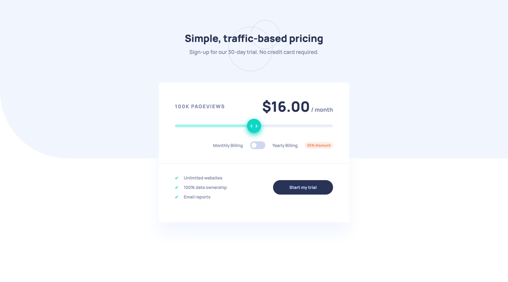

# Interactive pricing component

Challenge by [Frontend Mentor](https://www.frontendmentor.io?ref=challenge). Coded by Erwin Ruiz.

## Table of contents

- [Overview](#overview)
  - [The challenge](#the-challenge)
  - [Link](#link)
  - [Built with](#built-with)
  - [Layout](#layout)
  - [Screenshots](#screenshots)

## Overview

### The challenge

Users should be able to:

- View the optimal layout for the app depending on their device's screen size
- See hover states for all interactive elements on the page
- Use the slider and toggle to see prices for different page view numbers

### Link

- Live Site URL: [Click here](https://erwinruiz.github.io/interactive-pricing-component/)

### Built with

- Semantic HTML5 markup
- CSS custom properties
- Flexbox
- CSS Grid
- Mobile-first workflow
- TypeScript
- [React](https://reactjs.org/) - JS library
- CSS Modules

### Layout

The designs were created to the following widths:

- Mobile: 375px
- Desktop: 1440px

### Screenshots

- [Desktop](#desktop)
- [Mobile](#mobile)

#### Desktop

#### Mobile

